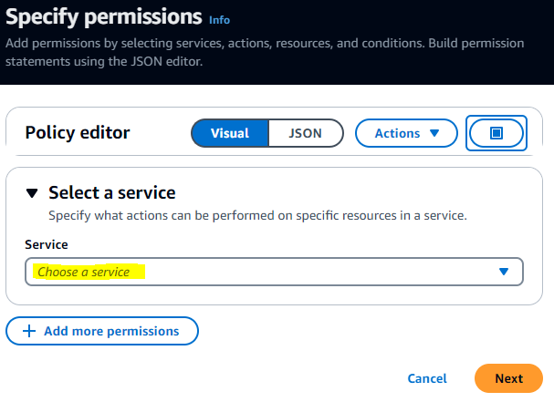
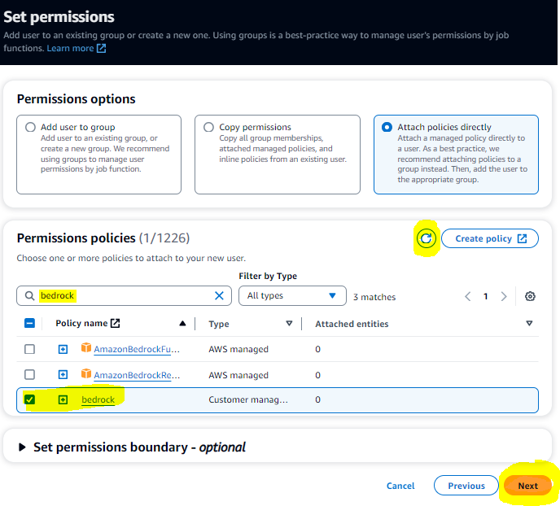

# BOSGIR
Text adventure game powered by the magic of LLMs.

Bald Old Short Guy In Red (or BOSGIR) is powered by the Bedrock service on AWS, so it requires and account there in order to play. It is a fully text-drive app, running on the client in a command-line window, with a UI powered by curses.

<!-- TOC start (generated with https://github.com/derlin/bitdowntoc) -->

- [Installation](#installation)
   * [Prerequisites](#prerequisites)
   * [AWS Setup](#aws-setup)
   * [AWS CLI Setup](#aws-cli-setup)
   * [Game Installation](#game-installation)
- [Running the Game](#running-the-game)
- [Some Notes on Playing the Game](#some-notes-on-playing-the-game)
   * [1. Entering Instructions For the Hero](#entering-instructions-for-the-hero)
   * [2. Tweaking Top-of-Mind Notes](#tweaking-top-of-mind-notes)
   * [3. Navigating the Story](#navigating-the-story)
   
<!-- TOC end -->

<!-- TOC --><a name="installation"></a>
## Installation

<!-- TOC --><a name="prerequisites"></a>
### Prerequisites
* Python w/Pip
* AWS account
* AWS CLI

<!-- TOC --><a name="aws-setup"></a>
### AWS Setup
BOSGIR relies on AWS to provide the LLM powering the game. Specifically, it uses the Bedrock service to invoke the Claude LLMs via an API. There is no requirement to deploy infrastructure via CloudFormation or anything, it just needs the Bedrock API which provides everything else. But there is some configuration required in the AWS console in order to be able to access the right foundation models.

1. Decide which AWS region you will be using. Basically, if you're on the east coast, it will be `us-east-1`, on the west coast it will be `us-west-2`. This decision shouldn't have any impact on your bill from AWS in regards to the Bedrock service.
1. Browse to the AWS IAM console: https://???.console.aws.amazon.com/iam/home?region=???#/users (replace both ???'s with the region string from the previous step)
**If this is the first time you've ever accessed the console, you will be logging in with your root account. If not, use whichever login has enough permissions to create a new user**
1. Click "Create user"

1. Enter "bosgir_api" for the user name, leave the checkbox unchecked, click Next

1. On the Permissions page, click "Attach policies directly," then the "Create policy" button

1. A new tab should open; click the Service drop-down and choose the Bedrock service

1. Expand the Read list

1. Check "InvokeModel" and "InvokeModelWithResponseStream"

1. Scroll down to Resources and select the "All" radio button and click Next

1. Name the policy "bedrock" then click Create policy

1. Close the Policies tab and go back to the Set Permissions tab for the new user. Click the refresh button next to the "Create policy" button, enter "bedrock" in the search box, check the policy you just created, then click Next

1. Click "Create user"

1. Click on the "bosgir_api" user you just created

1. Click on the "Security Credentials tab, then click the "Create access key" button

1. Select "Local code," then check the check box at the bottom, then click Next

1. Click "Create access key"

1. Click the copy icons next to each key (Access key and Secrete access key) and copy them into Notepad or another text editor; you will need them later. Click Done (Click Continue if you get a warning dialog about not viewing or downloading your key).

1. You should see your access key listed on the user's Access keys section with an active status


<!-- TOC --><a name="aws-cli-setup"></a>
### AWS CLI Setup
1. Install the AWS CLI by following [these instructions](https://docs.aws.amazon.com/cli/latest/userguide/getting-started-install.html)
1. Open a command line
1. Execute the following: `aws configure`
1. You will be prompted for the "AWS Access Key ID", enter it
1. You will be prmpted for the "AWS Secret Access Key", enter it
1. You will be prompted for the "Default region name", enter the region you decided on from step 1 of AWS Setup
1. Keep the default output format, then you're done.

<!-- TOC --><a name="game-installation"></a>
### Game Installation
1. Grab the code via git: open a command line and execute `git clone https://github.com/Gothmagog/bosgir.git`
1. cd into the root directory of the game: `cd bosgir`
1. Create a virtual environment by following the instructions [here](https://docs.python.org/3/library/venv.html#creating-virtual-environments)
1. Install the Python dependencies: `pip install -r requirements.txt`

<!-- TOC --><a name="running-the-game"></a>
## Running the Game
1. Open a command line and cd into the base directory of the code
1. [Activate the virtual environment](https://docs.python.org/3/library/venv.html#how-venvs-work)
1. `python src/index.py`

## Cost
Since BOSGIR is powered by the AWS Bedrock service, you will accrue charges as you play the game. BOSGIR keeps track of these charges for you, just below the Notes area on the right of the screen:


This is a running tab, separated into costs accrued from input tokens ("in:") and output tokens ("out:"). The Bedrock service charges a certain amount per 1000 tokens, for both input and output tokens. The pricing differs depending on which foundation model is chosen. BOSGIR uses the Claude v2 and Claude Instant v1 models.

The cost area will reset every time you play the game, so if you want to keep a closer, long-term eye on the costs associated with playing, you might look into [some options within the AWS console](https://console.aws.amazon.com/billing/home#/budgets/overview?tutorials=visible) (look on the right-side of the page for tutorials).

<!-- TOC --><a name="some-notes-on-playing-the-game"></a>
## Some Notes on Playing the Game
You'll be doing 3 things in the game, as follows (in order of frequency):

1. Entering instructions on what your hero does next
1. Tweaking the top-of-mind notes
1. Reading portions of the story that have scrolled out of sight

<!-- TOC --><a name="entering-instructions-for-the-hero"></a>
### 1. Entering Instructions For the Hero


This being a text adventure game, you will be typing a description of what your hero/character does next in the story, based on what's already happened in the story so far. Unlike traditional text adventure games, you don't have to worry about typing specific words, phrases, etc. Just describe what you want to do the way you would to a human being, then press enter (or CTRL-G).

For conversations with other characters, you can either describe what you want to say indirectly (`tell the priest about my bannana`), or you can say it directly by providing quotation marks around your text (`"I've got this incredible bannanna I'd like you to meet, father."`).

**HINT: Making your actions ambiguous, or stringing together multiple actions with "and" gives the AI more story-telling leeway**

To elaborate on this, say your character wants to go shopping at a store in the story. You could either enter the individual actions in minute detail, step-by-step:

```
open the door to the store
look for a hammer
pay for the hammer
leave
```

...which will result in each command yielding one or two paragraphs in response from the AI. Or you could do something like:

`shop for a hammer`

...which will result in 4-8 paragraphs worth of response from the AI. By describing the larger action, you're basically letting the AI fill in the gaps and narrate a larger portion of the story for you. I'ts really up to you, how much narrative control you want to cede to the AI.

<!-- TOC --><a name="tweaking-top-of-mind-notes"></a>
### 2. Tweaking Top-of-Mind Notes


First, what are top-of-mind notes? It's a way to subtly guide and remind the AI about the state of the game and what's important. Since [LLMs are text predictors](https://writings.stephenwolfram.com/2023/02/what-is-chatgpt-doing-and-why-does-it-work/), including important notes as part of their input right before they start spewing text helps keep it on track, so-to-speak.

These notes will get updated automatically by another LLM after the main output is generated. It's using this fresh output as a guide to tell it what it should update in those notes. For instance, if there was a part of the notes that indicates the hero is healthy, and then, as a result of the player typing `fight troll` the game describes the hero getting beaten to a pulp, the notes *should* update that status indicator to "injured" or something similar.

I emphasized "should" because this doesn't always happen. Sometimes the AI forgets to update a part of the notes. Sometimes it makes an update that doesn't make sense. Sometimes your hero's motivations might have changed and we want the AI to know about that. That's when we need to edit those notes before our next command.

But you start the game on the text prompt for entering commands, so how do I go about editing what's in that box on the right?

**Hit the ESCAPE key to choose which window to interact with**


*Hitting ESCAPE again from here will take you to the main menu where you can load a game, start a new one, or quit*

Press the number of the window you want to interact with. For notes, press "2".

Once you hit "2" you're editing the text in the notes window. Arrow keys, del, backspace, all work as you would expect. When you want to save your changes, press CTRL-G, or if you want to undo all the changes you've made, hit ESCAPE.

You can add and remove items from the notes as you see fit. You could in theory even create new sections, i.e. add a list of magic spells your character has learned. The only caveat is that the LLM is being given specific examples on how to update the notes as part of the prompt, so the further you edit the notes away from that initial format, the auto-updating of the notes may not work as well.

<!-- TOC --><a name="navigating-the-story"></a>
### 3. Navigating the Story
If you've been playing awhile and want to refer to a part of the story that has since scrolled out of view in the main window, you can choose the Story window ("1" after hitting escape) and use the arrow keys to scroll the content up or down; hit ESCAPE to return the window choice.

If you leave it scrolled away from the bottom of the story, the game will auto-scroll down to the latest part of the story once it processes your next command.
